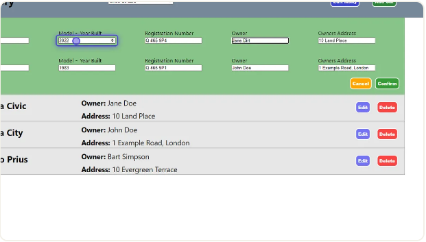

# Car Inventory Web Application

- [Description](#description)
- [Features](#features)
- [Credit](#credit)
- [Installation](#setup-and-installation)
- [Usage](#usage)

## Description

This web application allows users to store and manage information about their cars in a secure online database. It provides a user-friendly interface for adding, updating, and viewing car details. Built with a modern frontend and robust backend, the application ensures seamless performance and data integrity.

## Features

- **Add New Cars**: Easily add new car details including make, model, year, and other relevant information.
- **Update Car Information**: Edit existing car details to keep information up-to-date.
- **View Car Listings**: Browse through a list of all cars stored in the database.
- **Data Persistence**: Reliable data storage using MongoDB, ensuring that all car information is securely saved and retrievable.

## Technologies Used

- **Frontend**: React, Axios, CSS and CSS.Modules
- **Backend**: Node.js, Express, CORS, Body-Parser, Nodemon, Mongoose
- **Database**: MongoDB
- **Environment Management**: dotenv for environment variables
- **Version Control**: Git

## Contributing

Contributions are welcome! Please open an issue or submit a pull request for any features, bug fixes, or enhancements.

## Credit
[Will Hamilton](https://github.com/CodingHammy) - Author

## Setup and Installation 

1. **Clone the repository**:
    ```bash
    git clone https://github.com/your-username/your-repository-name.git
    cd your-repository-name
    ```

2. **Navigate to the backend directory and install dependencies**:
    ```bash
    cd backend
    npm install
    ```

3. **Navigate to the frontend directory and install dependencies**:
    ```bash
    cd ../frontend
    npm install
    ```

4. **Set up environment variables**:
- Create a `.env` file in the `backend` directory with the following content:

  
     ```plaintext
     MONGODB_URI=your_mongodb_uri_here
     ```

5. **Run the backend server**:
    ```bash
    cd ../backend
    npm start
    ```

6. **Run the frontend server**:
    ```bash
    cd ../frontend
    npm start
    ```

7. **Access the application**:
    - Open your browser and go to `http://localhost:3000` to access the frontend interface.

## Usage

**Adding a New Car**

Step 1:
Click the Add Car Button.


Step 2:
Fill in all the Input fields.


Step 3:
Click the Submit Button.


**Edit A Single Car**

Step One:
Select the car you wish to edit by clicking on the corresponding edit Button.


Step Two:
Fill in the Input fields that you wish to update.


Step Three:
Click the Submit Button.


**Deleting a Car**

Select the car you wish to delete by clicking on the corresponding Delete Button.


**Editing multiple Car**

Step One:

Click Edit Many button on Nav.


Step Two:

Check the checkboxes of the Cars you wish to edit.


Step Three:

Click Confirm after selecting desired cars


Step Four:

Fill in inputs fields in the cars you wish to edit



Step Five:

Click confirm after all edits have been made


